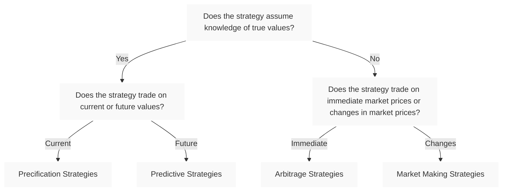

Quantitative trading strategies come in many shapes and sizes,
but can we classify them clearly and intuitively?
This post presents a simple, taxonomy to help you understand
and categorize quantitative strategies based on their
assumptions about current and future market data.

Additionally, what is a taxonomy you might ask?

> A taxonomy rule is a criterion or decision principle used to classify and
> organize items into mutually exclusive and collectively exhaustive categories
> within a hierarchical system.

So, below, we present a 3-rule, 2-level system to easily classify quantitative strategies.
Do note that this system is not ubiquitous, and was created by myself,
so it does not necessarily is the correct one, and any classification
that can encompass all existing strategies would be an equally good one.
The only difference between total mutually exclusive classifications is
the level of complexity in which we are interested in.

So, lets get into the rule set!

---

## Rule 1: The Key Question — Does the Strategy Use an Underlying Fundamental Value?

The first step to classifying any quantitative strategy is to ask:

**Does the strategy rely on knowledge of the asset’s “true value”
— a fundamental or fair price or intrinsic latent value —  when making trading decisions?**

* If **yes**, the strategy uses some form of estimate or knowledge about the
* true market value of the asset, whether known exactly or predicted.
* If **no**, the strategy does *not* assume any fundamental value but
* instead acts on observed market values or changes.

This key question divides quantitative strategies into two broad groups with very different approaches and goals.

---

## Rule 2: Trading on Current vs. Future Values

For strategies that **do assume knowledge of true values**,
the next important distinction is:

**Does the strategy trade based on an asset’s current value,
or does it trade based on predictions about future true values?**

* **Current true value:**
The strategy uses information about the present fundamental prices, market sentiment or
historical returns to make trades.
This is common in pricing models where the goal is to find mispriced assets and
exploit known differences.
* **Future true value:** The strategy tries to predict where the asset
*will* be in the future and trades based on those forecasts,
even though the true future value is uncertain.

This distinction leads us to two categories: **precification strategies** and
**predictive strategies**.

## Category 1: Precification Strategies

**Precification strategies** operate with knowledge or estimates of the **current true value** of assets. They assume the existence of a fundamental price and aim to identify when the market price diverges from this known or model-derived value.

### Examples

* **Derivative pricing models** like the Black-Scholes formula, which compute
fair prices for options based on current underlying asset values and parameters.
* **Risk-neutral valuation models** used by market makers to quote bid/ask prices
that reflect fair value under certain assumptions.
* **Market sentiment analysis models** that use financial news to determine whether
assets are under or overvalued.

The essence of precification is exploiting differences between *known* or *well-estimated* fundamental values and observed market prices.

## Category 2: Predictive Strategies

**Predictive strategies** focus on estimating **future true values** — trying to forecast the asset’s price or value at some point ahead.

These strategies rely heavily on signals, factors, or statistical models that offer insight into where the price will move. They assume their forecasts reflect some approximation of the future “correct” value, even if imperfect.

### Examples

* **Factor models** that predict returns based on value, momentum, or quality factors.
* **Machine learning models** trained on historical data to forecast price movements.
* **Sentiment analysis** from news or social media data,
predicting short-term market trends.

Predictive strategies attempt to capture alpha by anticipating future price changes grounded in underlying economic or behavioral factors.

---

## Rule 3: Trading on Immediate Market Observations vs. Changes in Market Values

For strategies that **do not assume knowledge of true values**, it’s important to understand how they interact with market data.

These strategies trade based on observable market prices, but they differ in their approach:

* Some trade based on **immediate market observations**, such as current prices or price discrepancies at a given moment.
* Others trade based on **changes in market values** — how prices evolve over time, capturing dynamics like spreads or liquidity provision.

Understanding this distinction helps clarify how these strategies create value and manage risk.

## Category 3: Arbitrage Strategies

**Arbitrage strategies** profit by exploiting **immediate market price discrepancies** without assuming knowledge of fundamental values.

They look for temporary mispricings across instruments or markets and expect prices to converge quickly, profiting from these short-lived opportunities.

### Examples

* **Statistical arbitrage** trading correlated securities when prices diverge.
* **Convertible bond arbitrage** exploiting pricing differences between bonds and stocks.
* **Cross-exchange arbitrage** capturing price differences between exchanges.

Arbitrageurs rely on market mechanics and convergence, not fundamental value knowledge.

## Category 4: Market Making Strategies

**Market making strategies** trade based on **changes in market prices** without assuming knowledge of true values.

Market makers provide liquidity by continuously quoting bid and ask prices, profiting from the spread and managing inventory risk, often using high-frequency data and order book information.

### Examples

* **Order book-based market making** managing inventory and spread capture in real time.
* **Statistical market making** adjusting quotes based on recent price moves or order flow.
* **Automated liquidity provision** in electronic or decentralized markets.

These strategies focus on market microstructure and price dynamics, rather than fundamental mispricing.

---

# Summary

This taxonomy of quantitative strategies helps us understand and categorize
approaches based on a 3-rule set of questions:

1. **Does the strategy rely on knowledge of the asset’s true value?**
2. **If yes, is this knowledge about current or future values?**
3. **If no, does it trade on immediate prices or changes in prices?**

This classification neatly divides quantitative strategies into four groups,
which are themselves not mutually exclusive,
as nothing stops a strategy from having elements of precification and prediction together.

* **Precification strategies** (knowledge of current true values)
* **Predictive strategies** (knowledge of future true values)
* **Arbitrage strategies** (no true value knowledge, trade on immediate prices)
* **Market making strategies** (no true value knowledge, trade on price changes)

Portfolio optimization strategies are separate from trading strategies,
in the regard that they use external strategies or models
to provide return estimates, or even predictive a posteriori rates,
such as the Black-Litterman model.
Portfolio strategies are a great example of how the classification itself
is not mutually exclusive, and very frequently can contain a mixture of
independent strategy components.

Understanding these groups and their defining features provides a clear
framework for analyzing quantitative trading methods.

